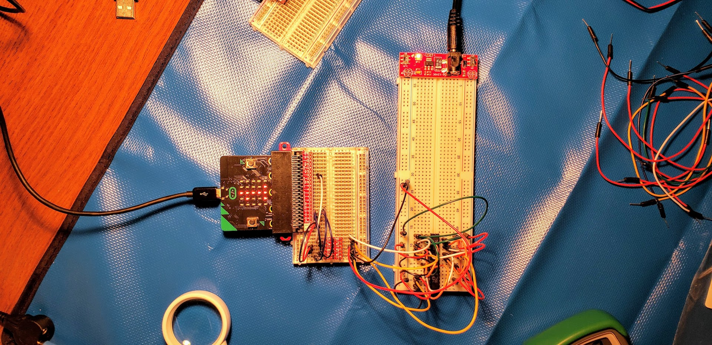
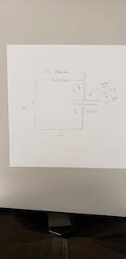
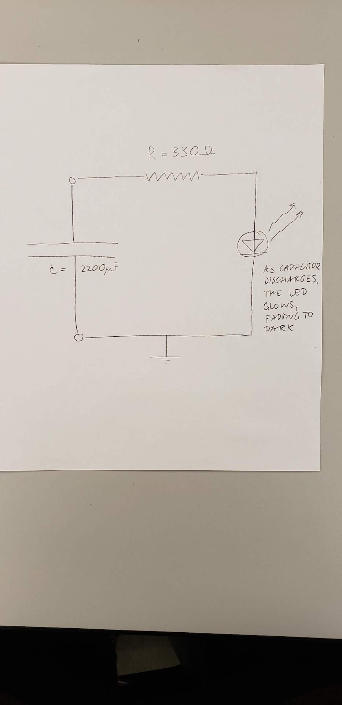
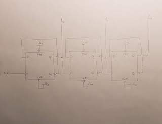
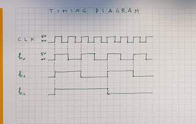

# CPE 1040 - Spring 2020

Author: Ivo Georgiev, PhD  
Last updated: 2020-03-19   
Code: b7700c9ccc9a009aacc7e5451992c43cc3135f87      



This is lesson and assignment 006 for the Spring 2020 installment of the CPE 1040 - Intro to Computer Engineering course at MSU Denver.

**NOTE:** 
1. This lesson & assignment [README](README.md) is _intentionally_ blank, to be used as the **Lab Notebook** for the study & submission. _It is a great aid for your study and the main component of your submission._
2. Read and follow the [lesson-and-assignment](lesson-and-assignment.md).
2. Refer to the [submission template](submission-template.md) for formatting expectations and examples. 
4. Refer to the [criteria and guide](criteria-and-guide.md) for the different components of your submission.

## Take-home lab kit

The take-home lab kit is meant to provide continuity of our lab projects across the transition to online instruction. Please, read the [BOM, guide, and care document](https://docs.google.com/document/d/18IDsrQlZY_QkmWG7FFtGqd9M2S1wL8ShJrD00aHwBwQ/edit?usp=sharing) and use it as a reference throughout the lesson and assignment.

##### Practice

We advise you to build a small circuit just to break it in. Suggestions:
1. Build our basic resistor and standalone LED on the long breadboard, and power it with 3.3V and 5V, using the power supply switch. _Is there a marked difference in brightness?_
2. Add a NPN transistor switch to the circuit, using the breadboard power supply ON-OFF switch as the base switch.

## Learning how to learn

The human mind is a very fine machine with amazing capabilities. And like any complex mechanism, it takes study to learn to use it effectively. This standalone section will contain practical information and advice for learning how to learn.

##### Learning How to Learn 01

1. The pain of learning.
   Knowledge is contain in the brain in complex neural structures, often distributed across the whole brain. Learning new knowledge is the process of _attaching_ or _fitting_ new concepts to your already existing _knowledge network_, and often requires significant rearranging to accomplish. This process is associated with _mild forms of pain and discomfort_. 
   
   TO DO: Learn to expect the natural discomfort that comes with learning and don't be afraid of it. Give it time. Approach the new concept from several different directions. Do not ever think that you are not good at this. You are already doing this just as everyone else. As your brain adjusts to the new knowledge, the pain goes away.
   
2. Focus & distraction.
   It might sound counterintuitive at first that both _focus_ and _distraction_ are important for learning, not just focus. The brain does different functions during focus and distraction, and all these functions contribute important steps to the learning process. Focus provides the ability to select a handful of related concepts, lock them into short-term memory, and apply directed effort to attach a new concept or set of concepts to the already existing knowledge. Incidentally, this is what is called _thinking_. Distraction helps the brain relax, recharge, and clean up.
   
   TO DO: The so called [_pomodoro technique_](https://francescocirillo.com/pages/pomodoro-technique) is a simple, yet effective way to gain operational control over periods of focus and distraction. Use a kitchen timer or the [online tomato timer](https://tomato-timer.com/), set it to 25 minutes and sit down to work a problem, keeping all distractions away (phone, other family members, bathroom, etc). Do your best to keep only the relevant concepts in mind and work the problem at hand. When the timer goes off, take a 5 minute distraction break. Take it as a reward, a chance to get brief relief from the discomfort. And practice. Like everything else, it takes some time to tell the difference and notice the effects. _Hint: 25 minutes is the average time the [hippocampus](https://en.wikipedia.org/wiki/Hippocampus) can remain fully active before it needs to rest. Some brains may be capable of less, say 15 minutes, or more, say 45 minutes. The online timer has adjustable settings, so you can experiment to find what works best for you._ 

## Lesson & Assignment 006: Flip-flops

This assignment & lesson introduces _capacitors_, _logic level conversion_, _flip-flops_, and _counters_:
  1. Capacitors are static circuit elements that can hold charge.   
  2. Flip-flops (aka _latches_) are among the simplest circuits that can have two different stable _states_ and their principle of operation lies at the basis of computer memory.    
  3. When two circuits work at differnet voltages, say 3.3V and 5V, any signals between them have to be safely converted.   
  4. Counters are sequential circuits which go continously cycle through several states representing binary numbers from 0 to some number 2n-1, in order.   

The goal of this assignment is to create a _modulus counter_ out of _D-type_ flip-flops, drive it from the micro:bit, and read off the 3-bit binary output with the micro:bit. The final build is shown in the image above. 

### Section 1: Capacitors

#### 1.1 Study

Capacitors are important cicruit elements which hold charge. They hold charge and their non-linear charging and discharging provide important functionality for circuits. They are represented as two plates with terminals as shown below:
```
    |
---------
---------   A capacitor has two plates across which there is voltage.
    |


    |   +
---------
---------   The voltage is caused by the accumulation and separation of opposite charges on the plates.
    |   -
    

    |   [+]
---------
---------   Some capacitors are polarized, with signs indicated. [+] should be connected to higher voltage.
    |   [-]
    
```
When voltage is applied to the two terminals, charge accumulates until the voltage between the plates (and terminals) of the capacitor equals the applied voltage. If the voltage is removed and there is a circuit connection between the two terminals, current flows from the terminal with the higher voltage toward the terminal with the lower voltage. Eventually, the current dissipates the accumulated charge and the voltage across the plates drops to zero.

Capacitors are a key component of a [flip-flop](https://www.youtube.com/watch?v=IykOrxVcdyg). Read the brief [section in Lesson 006: Memory on capacitors](https://docs.google.com/document/d/1TiirGwXiKg6ehxjVPpW-ISQryf8eqycvG4PZMq8cm2U/edit#heading=h.tfrh3hgmq4ay) and the materials referenced in it.

#### 1.2 Apply

1. This part lets you see how a capacitor operates. Build the circuit below on the long breadboard. _Note: If you don't have a 330 Ohm resistor, it's okay to use a 220 Ohm one. The 2200 uF capacitor is polarized, so [-] should be connected toward ground and [+] toward power._



2. The 2200uF capacitor is a large blue cylinder. It is _polarized_, so make sure you connect it properly.
3. Make sure the capacitor starts out _discharged_. _Hint: Connect the two terminals to a resistor._
4. Attach the multimeter, in voltage mode, at the point V<sub>C</sub> or, in current mode, anywhere in the circuit. Apply the circuit voltage source and watch the reading of the multimeter. As the capacitor charges, current will flow and there will be voltage drop across the resistor. When the capacitor reaches its charge capacity (that is, it _charges_), the current will diminish to zero Amperes and the voltage at V<sub>C</sub> will climb back to the power-supply voltage (either 3.3V or 5V). _Why?_
4. Now take the capacitor out of the circuit, making sure you don't touch the terminals to each other or connect them with a conductive channel, and plug it into the second circuit below:



5. Watch the LED light up then quickly fade to dark as the capacitor discharges through the circuit.

#### 1.3 Present

In the [Lab Notebook](README.md), include:
1. A short narrative about the experiment. _What is the voltage when the capacitor finishes charging? Why?_
2. The approximate time to charge and discharge the capacitor. (2 values)
3. An instantaneous value for the charging and discharging currents. (2 values) _Note: These currents are not constant, and with this equipment we may only be able to capture an instantaneous non-zero current value._

### Section 2: Logic level converter

#### 2.1 Study

The micro:bit works at 3.3V while we have to operate the circuit on the long breadboard at 5V. This means that a _logic high_ in the two circuits is actually at different voltages. Logic level voltages are a [big deal](https://www.allaboutcircuits.com/textbook/digital/chpt-3/logic-signal-voltage-levels/). Read the [short section in Lesson 006: Memory on binary numbers](https://docs.google.com/document/d/1TiirGwXiKg6ehxjVPpW-ISQryf8eqycvG4PZMq8cm2U/edit#heading=h.2bm72yu21rie).

Most importantly for us, the two circuits should **not** be connected directly to each other (as we did in the last assignment :D). Instead, we use a voltage (aka logic) level converter circuit to bridge the micro:bit and long breadboard circuits. We will be using [one of two voltage level boards](https://docs.google.com/document/d/18IDsrQlZY_QkmWG7FFtGqd9M2S1wL8ShJrD00aHwBwQ/edit#heading=h.fx9d22emrhnr). On the [board diagram of Bi-Directional Logic Level Converter](https://learn.sparkfun.com/tutorials/bi-directional-logic-level-converter-hookup-guide#board-overview), notice the [zener diode](https://www.digikey.com/en/maker/blogs/zener-diode-basic-operation-and-applications) across the FET, pointing from low voltage to high voltage!

#### 2.2 Apply

1. Hook up one of the converters and power it properly as shown in the hookup guide. It is best to use the lower part of the short breadboard, below the micro:bit breakout. You need to power the two sides with the two different voltages and two _different grounds_! _Warning: Please, do not confuse the **low voltage 3.3V** with the **high voltage 5V** or you will damage the converter._
2. Hook up a powered wire from the long breadboard to one of the lines on the _high-voltage (HV) side_. Connect the multimeter to the opposite terminal on the _low-voltage (LV), to measure the voltage. Use the long breadboard power supply ON-OFF switch to power and depower the line. _Please, do this very gently!!!_
3. Now connect the _LV_ pin to a digital input pin of the micro:bit. Read the pin and light the LED matrix position at (0, 0) depending on the reading. Power and depower the line on the _HV_ pin. 
4. Hook up a ditigal output pin from the micro:bit to the _LV_, drive it with a short program, and measure the voltage on the _HV_ with the multimeter.
5. Now build a simple resistor-and-LED circuit on the long board, and drive it with the _HV_ pin. 

#### 2.3 Present

In the [Lab Notebook](README.md), include:
1. A short narrative about the experiment.
2. Short video of the operation of the circuit from 2.2.3.
3. Short video of the operation of the circuit from 2.2.5.

In the [repository](./), include:
1. File `microbit-program-2-2-3.js` with the code you used in task 2.2.3.
2. File `microbit-program-2-2-5.js` with the code you used in task 2.2.5.

### Section 3: Clock signal from the micro:bit

#### 3.1 Study

The flip-flop, which is the main theme of this lesson & assignment, is one of the simplest example of a large family of electronic circuits, called _sequential circuits_. Read the [short section in Lesson 006: Memory on sequential circuits](https://docs.google.com/document/d/1TiirGwXiKg6ehxjVPpW-ISQryf8eqycvG4PZMq8cm2U/edit#heading=h.c4o6su7uj2bg). The name "sequential" comes from the property of theses circuits to occupy different _states_ and their ability to switch from one state to another, in a predetermined sequence. Read the [short section in Lesson 006: Memory on state](https://docs.google.com/document/d/1TiirGwXiKg6ehxjVPpW-ISQryf8eqycvG4PZMq8cm2U/edit#heading=h.bal0y2eurxvq). 

Computers are large and complex sequential circuits with many components, the function of which has to be tightly _synchronized_. In simplest terms, this means that computer components have to change states at the same time, in strictly determined order. For this reason, each component changes state _only_ upon receiving a synchronizing signal, called a _clock_. Clock signals are almost exclusively in the form of _square waves_. The diagram below shows what a square wave looks like and why it's called so:
```
   5V       |------|      |------
            |      |      |          This is a "square" wave, which is typical of clock (CLK) signals in electronics.
   0V ------|      |------|          It changes from logic low to logic high and repeats forever.
                                     It is called "square" because of the right angles the horizontal and vertical edges form.
   ```
Different components are designed to change state at different _events_ of the square wave. The 4 main events are:
  1. Logic high.
  2. Logic low.
  3. Positive edge (that is, switching from low to high).
  4. Negative edge (that is, switching from high to low).
```
   5V       |------|      |------
            |  ^   |      |          Square wave with the different state-change events.
   0V ------|  |   |------|          
            ^  |   ^   ^
            |  |   |   |
            |  |   |   low
            |  |   neg edge
            |  high
            pos edge
   ```
The square wave is only one of a number of wave _functions_ that are commonly used in electric and electronic circuits. Two other common functions are the _triangle_ and _sine_ waves. A device that can generate various functions is called a _function generator_. This is one lab device that we have not been able to replace affordably for the take-home lab kit. Intead, we will use the micro:bit to generate our square wave.

#### 3.2 Apply

1. Write a program to produce a clock signal on the output of a digital write pin. Here is a simple program to get you started:
```TypeScript
basic.forever(function () {
    pins.digitalWritePin(DigitalPin.P12, 1)  // positive edge
    basic.pause(200)
    pins.digitalWritePin(DigitalPin.P12, 0)  // negative edge
    basic.pause(200)
})
```
2. Hook up pin 12 _through the logic level converter_ (from **3.3V** to **5V**) and to the simple circuit from task 2.2.5.
3. Modify the program to double the frequency (halve the pause time) on the press of button A and to halve the frequency (double the pause time) on the press of button B. _Hint: Look at your previous programs. You should have all the code._

#### 3.3 Present

In the [Lab Notebook](README.md), include:
1. A short narrative about the experiment.
2. Short video of the operation of the circuit from 3.2.2.
3. Short video of the operation of the circuit from 3.2.3.

In the [repository](./), include:
1. File `microbit-program-3-2-2.js` with the code you used in task 3.2.2.
2. File `microbit-program-3-2-3.js` with the code you used in task 3.2.3.

### Section 4: D-type flip-flop

#### 4.1 Study

Read the [section on the flip-flop in Lesson 006: Memory](https://docs.google.com/document/d/1TiirGwXiKg6ehxjVPpW-ISQryf8eqycvG4PZMq8cm2U/edit#heading=h.txu21jmors55) and the linked materials.

##### Notes on reading the datasheet

1. Our lab has 74LS74 chips, each containing two D-type positive-edge triggered flip-flops.
2. Only the first page of the [datasheet](http://www.ti.com/lit/ds/symlink/sn74ls74a.pdf) is necessary for this project.
3. Our chip has the _form factor_ and _pinout_ at the top right.
4. The _logic symbol_ at the bottom left shows _inputs on the left_ and _outputs on the right_, with signal flow and operation _from left to right_. This is standard in electronics diagrams.
5. The operation is specified in two ways:
   1. The _description_ does it in words. _In summary, the device transfers its input value at D onto its output Q (and inverted output /Q) only upon a positive edge of the clock input CLK._
   2. The _FUNCTION TABLE_ does it symbolically, but is equivalent to the description. _Note: An X represents a "don't care" input, that is, it doesn't matter what its value is; and an upward arrow means a positive edge._

#### 4.2 Apply

**TODO:**  Single flipflop, with output driving two external LED circuits. _Can it?_ Also, the clock should flash at matrix position (0, 0).

1. Place a 74LS74 chip in the middle of the long breadboard tile (across the center groove). _Note: The chip has a **notch** or **dent**, which has to be pointing **UP**. Otherwise, you will burn both the chip and the tile underneath. Refer to the [lab kit guide](https://docs.google.com/document/d/18IDsrQlZY_QkmWG7FFtGqd9M2S1wL8ShJrD00aHwBwQ/edit?usp=sharing) for details._
2. Using the pinout of the chip, shown in the datasheet, connect the chip to V<sub>CC</sub> of 5V and GND of 0V.
3. Build two of our standard resistor-and-LED circuits on the long board and connect them to **1Q** and **1/Q**. _Note: The bar on top of a symbol, in this case Q, means NOT. That is, whatever the value of Q is (logic high or logic low), /Q will be the opposite. We are using the **forward slash** because markdown cannot represent a bar._ See the diagram below:
   ```
                                 ^^
   -----                        //
       |       220 Ohms        //
     1Q|------/\/\/\/\/------[LED]-----                       This is for 1Q. Do the same for 1/Q.
       |                              |
       |                              |
       |                            -----
       |                             ---
       |                              -
   ```
3. Connect the HV pin of the converter corresponding to your micro:bit clock signal from task 3.2.2 to the **1CLK** pin of the flip-flop IC.
4. Modify the original program to blink the LED matrix at position (0, 0) with the clock.
5. Connect **1/CLR** and **1/PRE** to logic high (5V).
6. Using your micro:bit buttons, select a very low clock frequency to drive the flip-flop. At low frequency, you will see a lag between micro:bit LED matrix position (0, 0) and the external LEDs on the long breadboard.
7. Increase the frequency to see that the lag stops being dinstinguishable.

#### 4.3 Present

In the [Lab Notebook](README.md), include:
1. A short narrative about the experiment.
2. An image with your hand-drawn diagram of the whole circuit. Use boxes for the micro:bit, converter board, and the flip-flop chip. Label all pins.
2. Short video of the operation of the circuit from 4.2.6.
3. Short video of the operation of the circuit from 4.2.7.

In the [repository](./), include:
1. File `microbit-program-4-2-4.js` with the code you used in task 4.2.4.

### Section 5: Reading clocked flip-flop output with the micro:bit

#### 5.1 Study

Further on in the assignment we are going to need to read the output of our overall circuit _at a precise point in time_ so as to avoid missed values and duplicates. We will do this for the 1 flip-flop first and then extend to the 3 which we will need for the final circuit.

Study the micro:bit JavaScript function [`onPulsed`](https://makecode.microbit.org/reference/pins/on-pulsed). Guidance:
1. It is an _event-handler setter_. _Setter_ means that it is a function which specifies (sets) the handler function for some event. State your understanding of the terms _event_, _event handler_, and _asynchronous execution_.
2. Remember what other similar micro:bit JS functions you are familiar with, and list them.
3. Look at the function signature (name + argument types + return type) and asnwer the question _what the event being handled here is_.
4. Look at the arguments and answer the question _what the event handler is in this case_.
5. Bearing in mind that the alternating voltage levels of the square wave are also called _pulses_, notice the second argument of `onPulsed`, remember the signal events for the square wave, and answer the question _which of the events we can specify_.
6. Considering that we want to read the flip-flop output at the right moment in time, think about when our flip-flop changes state and answer the question _what value we should pick for the second argument of the pulse event handler setter_. _Hint: Look ahead at the top two lines of the [Timing Diagram](https://github.com/ivogeorg/ce-lesson-and-asst-006-flip-flops/blob/master/images/timing-diagram.jpg) in Section 6._

#### 5.2 Apply

1. Disconnect the **1Q** output from the LED circuit.
2. Pick a micro:bit GPIO pin as a digital read pin and connect the **1Q** output to it through one of the lines of the voltage level converter.
3. Modify your program from task 4.2.6 as follows:
   1. Add pulse event handler setters with the proper arguments. _Make sure you have gone through the Study section first and have you can confidently answer the questions._
   ```TypeScript
   // this is just a general skeleton for your program
   
   // Global Variables
   let pause_us : number = 200   // pause period in microseconds

   // Event Handling
   input.onButtonPressed(Button.A, function () {
        // control the frequency of the square wave
   })
   // other button events here...
   
   pins.onPulsed(DigitalPin.P2, PulseValue.Low, function () {
       // take a reading of pin P2 when it is pulsed low
   })
   // other pin events here...

   // Repeated Actions
   basic.forever(function () {
       pins.digitalWritePin(DigitalPin.P12, 1)  // positive edge of clock
       basic.pause(pause_us)
       pins.digitalWritePin(DigitalPin.P12, 0)  // negative edge of clock
       basic.pause(pause_us)
   })
   ```
   2. Take readings of the digital read pin at the appropriate times.  _Make sure you have gone through the Study section first and have you can confidently answer the questions._
   3. Synchronize the micro:bit LED matrix at position (0, 1) with the digital read pin. That is, the LED should be lit when the reading is logic high. _Note that this is one position below the clock generator indicator LED at position (0, 1). This way you will be able to watch them next to each other._
4. Run the program to drive the D-type flip-flop and read its values. Change the clock frequency up and down. _What can you tell about the relative frequency of the clock and the flip-flop Q output?_

#### 5.3 Present

In the [Lab Notebook](README.md), include:
1. A short narrative about the experiment.
2. Answers to the questions in 5.1.
3. Answers to the questions in 5.2.
4. An image with your hand-drawn diagram of the whole circuit. Use boxes for the micro:bit, converter board, and the flip-flop chip. Label all pins.
5. Short video of the operation of the circuit from 5.2.4.

In the [repository](./), include:
1. File `microbit-program-5-2-4.js` with the code you used in task 5.2.4.

### Section 6: 3-bit modulus counter

#### 6.1 Study

Counters are an important class of sequential circuits which are designed to cycle through several states corresponding to the _binary_ natural numbers, in order from zero to some number `n - 1`. They are also known as _modulus-n_, _modulo-n_, or _mod-n_ counters.

1. Read the introduction to the Wikipedia article on the [modulo operation](https://en.wikipedia.org/wiki/Modulo_operation) and answer the question _how many states does a mod-n counter have_.

2. Notice that we are talking about an electronic circuit and therefore it represents numbers in binary and answer the question _what minimum number of bits is required to represent a mod-N counter, where N is some natural number_.

3. Study the following circuit, which is a _mod-8 counter_, and explain _how it works_. Guidance:
   1. Remember that signals flow from left to right, so inputs are going to be on the left of a device and outputs on the right (although, in this diagram, the outputs of the overall circuit are shown to go up for clarity).
   2. Notice that the circuit is composed of 3 D-type flip-flops in a row, and the output of one is the input of another and answer the question _what the only input to the mod-8 counter is_.
   3. Notice that **1/Q** is connected to **1D** and answer the question _whether this is okay and might the input and output interfere with each other when they are directly connected to each other_.
   
   _Note: An **active low** signal (one which is designed to be "on" when it is **logic low**), like **1/Q** and **1/CLR**, can be represented in a diagram with its non-negated name, that is, **Q** and **CLR** in this case, and a circle ° outside the box at the terminal pin, as it is done in this diagram. The circle comes from the shortened representation of an **inverter** (skim the Wikipedia article on [inverter logic gate](https://en.wikipedia.org/wiki/Inverter_(logic_gate))). This notation is equivalent to the bar (forward slash in our case) over the name._
   4. Remember when our D-type flip-flop changes state and trace the signals through the circuit, as shown on the following diagram:
   
   5. Complete the full timing diagram for one full cycle to prove that this is a mod-8 counter. 
   6. Remember what the bit patterns of the binary numbers [0<sub>10</sub>, 7<sub>10</sub>] are and answer the question _how you are going to read off the numbers from the diagram_.

#### 6.2 Apply

1. Using two 74LS74 chips, build a 3-bit modulus counter from 3 of the D-type flip-flops. _Don't forget to place the chips with notches pointing up, and to power and ground each chip. See the [lab kit guide](https://docs.google.com/document/d/18IDsrQlZY_QkmWG7FFtGqd9M2S1wL8ShJrD00aHwBwQ/edit?usp=sharing) for details._
2. Use the same clock signal from 3.2.2 and following tasks, connected through the logic level converter board to the **1CLK** input of the first (leftmost on the diagram) D-type flip-flop.
3. Connect all 3 **/CRL** and 3 **/PRE** to logic high (5V).
4. Pick 2 more micro:bit GPIO pins to be digital read and connect the remainging two outputs **3Q** and **2Q** through the last 2 remaingin lines of the logic level converter board to them. Together with the already connected **Q1** from the previous section, these represent the **b<sub>2</sub>b<sub>1</sub>b<sub>0</sub>** output in the drawing above, which in turn represents a 3-bit binary integer. _Explain in what order the 3 bits should be read to properly represent a binary integer._
5. Modify your program from task 5.2.4 as follows:
   1. Read all 3 digital pins at the proper time. _Explain whether the events at which your took the readings in the previous sections are still the appropriate times to read all three digital input pins, or, if not, what the appropriate time is._
   2. Synchronize the resulting **b<sub>2</sub>b<sub>1</sub>b<sub>0</sub>** pattern with LED positions (0:2, 1).
   3. (Optional) Pick 3 free micro:bit GPIO pins and drive 3 standard external resistor-and-LED circuits in synchrony with the LED matrix pattern.
6. Load the program, turn on the power, and observe the operation of your circuit. _Do you have a 3-bit mod-8 counter or something else? If it's indeed a counter, is it counting upward or downward? When you turn the power off and on repeatedly, does the direction change? Explain why or why not._

#### 6.3 Present

In the [Lab Notebook](README.md), include:
1. A short narrative about the experiment.
2. Answers to the questions in 6.1.
3. Answers to the questions in 6.2.
4. An image with your hand-drawn diagram of the whole circuit. Use boxes for the micro:bit, converter board, and the flip-flop chip. Label all pins.
5. Short video of the operation of the circuit from 6.2.6.

In the [repository](./), include:
1. File `microbit-program-6-2-5.js` with the code you used in task 6.2.5.

### Section 7: Display decoded counter output on micro:bit LED matrix

#### 7.1 Study

Now that we have a reading of the 3-bit counter output and can verify its proper execution by displaying it as a bit-pattern on a line of LEDs, we can turn to a more useful display of the counter values. In particular, we want to use `showNumber` to show the current counter value in _decimal_.

1. Recall how non-negative integers expressed in different _positional numeral systems_ can be converted from one to another, and come up with an expression to convert the 3-bit binary number into a decimal number. _How many digits does a 3-bit binary number have when converted to decimal?_

Now that we don't have a fully equipped lab, we use a `forever` loop to generate the clock signal in the micro:bit, instead of using an [external function generator](https://www.rigolna.com/products/waveform-generators/dg1000/) or a [clock source output](https://www.nordicsemi.com/-/media/Software-and-other-downloads/Product-Briefs/nRF51822-product-brief.pdf?la=en&hash=A4B5A9AA6675A58F7B779AF81C860CD69EB867FD) from the micro:bit. As we expand our program with additional features (now showing the counter value in decimal), we can anticipate that the code for each additional feature is going to swell unevenly throughout the structure of our program, potentially _skewing_ the square wave for the clock. Skim the Wikipedia article on [clock skew](https://en.wikipedia.org/wiki/Clock_skew) to reinforce your understanding of the significance of clock signals and simultaneously learn about the beneficial and detrimental effects of clock skew. For us, the clock skew may look as shown in the diagram:
```
   5V       |------|        |------
            |      |        |          A skewed square wave...
   0V ------|      |--------|          
                            ^
                            |
                            this edge arrives too late!
```
This is equivalent to having a program with uneven or even random `pause` intervals:
```TypeScript
basic.forever(function () {
    pins.digitalWritePin(DigitalPin.P12, 1)  // positive edge
    basic.pause(pause_us)
    pins.digitalWritePin(DigitalPin.P12, 0)  // negative edge 
    basic.pause(Math.randomRange(pause_us - 50, pause_us + 50))  // next positive dithers (i.e. is uneven)
})
```
To counteract such effect, we need to understand more about the inner workings of the micro:bit.

2. A full account of the [micro:bit software stack](https://mattwarren.org/2017/11/28/Exploring-the-BBC-microbit-Software-Stack/) is beyond the scope of this lesson & assignment, but MakeCode provides a simplified, though still extensive, description. Read the micro:bit reference section on [asynchronous event handling, concurrent execution, and fiber scheduling](https://makecode.microbit.org/device/reactive). Guidance:
   1. This reference section is called _Reactive_ and the first thing that you read in it is that the micro:bit continuously reacts to _events_. _In your words, what is your understanding of an event after doing the reading?_
   2. _Concurrent_ execution is one of the most powerful capabilities of modern computers and, specifically, the runtime environments and operating systems which support it. In simple terms, concurrency is _execution **at the same time**_. _In your words, how does the micro:bit achieve the **illusion of execution at the same time**?_ 
   3. You already knew that different parts of your program are executed at differnt times and (i) that is not usually obvious from reading the code, and (ii) you, as a programmer, have limited control over what executes when. The clock skew we are talking about is one of the effects of our limited control. _In your words, what does the **scheduler** do and how do you think it might cause the subprogram that you wrote to do one thing a certain way to actually do it another way or do something entirely unintended?_
   4. The fact that there is some _non-determinism_ in the execution of your program should not discourage you. Instead, you should use new knowledge of the mechanisms of program execution to write your code to minimize or even completely avoid the unintended effects. A significant part of being a good programmer is such knowledge and skill. Computer engineers have a merked advantage due to their knowledge of hardware and low-level programming. So, let's practice. In the light of what you read, discuss the pros and cons of _putting the square wave generator subprogram and the binary decoding in **two separate `forever` loops**.

#### 7.2 Apply

1. Modify your program from task 3.2.5 as follows:
   1. Remove from the original `forever` loop all code for syncing LED matrix positions with the flip-flops' **Q** outputs.
   2. Leave the blinking (0, 0) code in the original `forever` loop.
   3. Write a function `bin2dec` with three number arguments, one for each bit of the counter, to decode the binary pattern and return a number in decimal.
   4. Add a second _separate_ `forever` loop in which you repeatedly call `bin2dec` with the current values of the 3 bits as set by your pin event handlers.
2. Run the program and circuit. Answer the following questions:
   1. Is your counter displaying correctly? 
   2. Do you notice some numbers displaying longer than others (that is, clock skew)? 
   3. Does the unevenness, if any, change with increasing or decreasing the clock frequency? Why or why not? 
   4. Is the (0, 0) LED still blink evenly with the clock? Why or why not?
3. Revisit your discussion on separating subprograms in multiple `forever` loops.

#### 7.3 Present

In the [Lab Notebook](README.md), include:
1. A narrative about the experiment.
2. Answers to the questions in 7.1.
3. Answers to the questions in 7.2.
4. Short video of the operation of the circuit and program from 7.2.2.

In the [repository](./), include:
1. File `microbit-program-7-2-2.js` with the code you used in task 7.2.2.

### Section 8: Flip-flop control signals

#### 8.1 Study

If you have seen that your counter counts backwards, it may be because the flip-flop starts in a random unstable state and stabilizes into a wrong state. We can attempt to remedy this by using one of the _control signals_. Looking at the function table in the [74LS74 datasheet](http://www.ti.com/lit/ds/symlink/sn74ls74a.pdf), notice and understand that:
1. The control signals are **/PRE** and **/CLR**. _Where does it say so?_   
2. They override all other signals. _Where is this shown?_    
3. They are _active low_. _How can you determine that?_   
4. **/PRE** forces **Q** to _logic high_, whereas **/CLR** forces it to _logic low_. _Explain how this is known?_   

When we turn power on and the clock signal is active, the counter just starts working from a random startup state. We need to instead initialize it in a known state. In particular, we need to start the counter at `000`. To do this, we can connect all **/CRL** signals together and drive them with a logic-low pulse from the micro:bit. Unfortunately, our voltage converter board only has 4 lines, and we are already using them for the clock and the 3-bit input. We will need to trade.

#### 8.2 Apply

1. Disconnect the **3Q** output corresponding to **b<sub>2</sub>** from the HV pin of the voltage converter board. We won't need it.
2. Disconnect the digital input line from the corresponding LV pin and ground it on the micro:bit. _Why should we do this?_
3. Disconnect **1/CLR**, **2/CLR**, and **3/CLR** from logic high at 5V, connect them together, and then connect them through the vacated voltage converter line to an unused digital write micro:bit GPIO pin.
4. Modify the program from 7.2.2 to output a short low pulse (see diagram below) at the digital write pin on a simultaneous press of both buttons. _How will you do this in code?_
5. Power and run the circuit with the new program. _What counter do you have now?_
6. Press `AB` to initialize the counter in the proper known state `00`. _Is it working? If your counter was counting downward, does this fix it? Explain what you see to the best of your knowledge._

#### 8.3 Present

In the [Lab Notebook](README.md), include:
1. A narrative about the experiment.
2. Answers to the questions in 8.1.
3. Answers to the questions in 8.2.
4. Short video of the operation of the circuit and program from 8.2.6.

In the [repository](./), include:
1. File `microbit-program-8-2-6.js` with the code you used in task 8.2.6.

## Resources

### micro:bit 

1. [micro:bit lessons](https://makecode.microbit.org/lessons).
2. [micro:bit ideas](https://microbit.org/ideas/).
3. A list of some more [advanced projects](https://www.itpro.co.uk/desktop-hardware/26289/13-top-bbc-micro-bit-projects).
4. The [projects](https://github.com/carlosperate/awesome-microbit#%EF%B8%8F-projects) at the [awesome micro:bit list](https://github.com/carlosperate/awesome-microbit).
5. micro:bit [technical documentation](https://tech.microbit.org/).
6. micro:bit [reference](https://makecode.microbit.org/reference/), and [pins](https://makecode.microbit.org/reference/pins/servo-set-pulse), specifically.

### Transistors
1. Video of [transistor operation](https://www.youtube.com/watch?v=7ukDKVHnac4)
2. Video of [PN diode operation](https://www.youtube.com/watch?v=-SSkjWuUri4)
3. Video of [NPN and PNP transistor operation](https://www.youtube.com/watch?v=R0Uy4EL4xWs)
4. Video of [NPN vs. PNP Transistors as Common-Emitter Switches](https://www.youtube.com/watch?v=kNVaIqmKUoI)
5. Video of [semiconductor operation](https://www.youtube.com/watch?v=33vbFFFn04k) by Ben Eater.
6. Video of [transistor operation](https://www.youtube.com/watch?v=DXvAlwMAxiA) by Ben Eater.
7. Video of [MOSFET operation](https://www.youtube.com/watch?v=stM8dgcY1CA)

#### Transistor datasheets

1. NPN transistor [2N3904 datasheet](https://www.sparkfun.com/datasheets/Components/2N3904.pdf)
2. PNP Transistor [2N3906 datasheet](https://www.sparkfun.com/datasheets/Components/2N3906.pdf)

### Flip-flops
1. Very in-depth yet accessible Wikipedia article on [flip-flops](https://en.wikipedia.org/wiki/Flip-flop_(electronics))
2. Video of [flip-flop circuit build & operation](https://www.youtube.com/watch?v=IykOrxVcdyg)

#### Flip-flop datasheets

1. D-type flip-flop [74LS74](http://www.ti.com/lit/ds/symlink/sn74ls74a.pdf)

### Capacitors

1. A short lesson and video on [how a capacitor works](https://www.build-electronic-circuits.com/how-does-a-capacitor-work/)

### Sensors

1. SparkFun soil moisture sensor [hookup guide](https://learn.sparkfun.com/tutorials/soil-moisture-sensor-hookup-guide). _Note: The guide is for Arduino, not micro:bit, but that does not affect the operation of the sensor See the intro item in the [soil sensor section above](#soil-sensor)._

### Logic level converter

1. [Bi-directional logic level converter](https://www.sparkfun.com/products/12009) between 3.3V and 5V.
2. Converter [schematic](https://cdn.sparkfun.com/datasheets/BreakoutBoards/Logic_Level_Bidirectional.pdf), N-channel MOSFET [datasheet](https://cdn.sparkfun.com/datasheets/BreakoutBoards/BSS138.pdf), with [operation explanation](https://cdn.sparkfun.com/tutorialimages/BD-LogicLevelConverter/an97055.pdf), and **most importantly** [hookup guide](https://learn.sparkfun.com/tutorials/bi-directional-logic-level-converter-hookup-guide).

### Oscilloscopes

1. Video [Oscilloscopes Made Easy Part 1](https://www.youtube.com/watch?v=uU3FhH7_MWo&t=1s)
2. Video [EEVblog #279 - How not to blow up your oscilloscope](https://www.youtube.com/watch?v=xaELqAo4kkQ)
3. Video [Oscilloscopes Made Easy Part 2](https://www.youtube.com/watch?v=5VyotIVwRiA)
4. Video [How to use an oscilloscope (SparkFun)](https://www.youtube.com/watch?v=u4zyptPLlJI)
5. Video [Oscilloscope tutorial](https://www.youtube.com/watch?v=CzY2abWCVTY)
6. Video [Rigol 1000s Series docs (manuals, datasheets, videos)](https://www.rigolna.com/products/digital-oscilloscopes/1000z/)

### Github

1. Github Tutorial for Beginners ([webpage](https://product.hubspot.com/blog/git-and-github-tutorial-for-beginners)).
2. Github Basics for Mac and Windows ([video](https://www.youtube.com/watch?v=0fKg7e37bQE)).
3. git & Github Crash Course for Beginners ([video](https://www.youtube.com/watch?v=SWYqp7iY_Tc)).
4. Introduction to Github for Beginners ([video](https://www.youtube.com/watch?v=fQLK8Ib_SKk)).
5. About `git` ([webpage](https://git-scm.com/about)).
6. `git` [documentation](https://git-scm.com/doc) (webpage, book, videos, reference manual).
7. [Github markdown cheat sheet](https://github.com/adam-p/markdown-here/wiki/Markdown-Cheatsheet).

### JavaScript

1. Technically, the language which is used side-by-side with Blocks in the Makecode ronment is a subset of [TypeScript](https://makecode.com/language), which itself is a superset of JavaScript (technically, [ECMAScript](https://www.ecma-international.org/ecma-262/10.0/index.html#Title)), with some JS features not implemented in Makecode.
2. The limited [JavaScript mini-tutorial](https://makecode.microbit.org/javascript) in Makecode.
3. Official [TypeScript documentation](https://www.typescriptlang.org/docs/home.html):
   1. TypeScript in 5 min [tutorial](https://www.typescriptlang.org/docs/handbook/typescript-in-5-minutes.html). _Note: You will need to [download](https://www.typescriptlang.org/index.html#download-links) and install an integrated development environment (IDE). The two that I recommend are Visual Studio Code from Microsoft and WebStorm from JetBrains._
   2. The full documentation and reference is under _Handbook_. Bear in mind that you are drinking from the hose. Don't be surprised if not everything is presented in a strictly incremental manner.
4. In-browser TypeScript [playground](https://www.typescriptlang.org/play/index.html). Note that micro:bit specific code will not run, but you can still play. _Start making the distinction between a generic multi-purpose programming language (TypeScript) and functionality (packages, libraries, objects, etc.) that is specific to a particular device (micro:bit), though written in the same programming language._
5. A pretty good and very palatable JS tutorial with in-browser coding, by [Codecademy](https://www.codecademy.com/learn/introduction-to-javascript).
6. Extensive and detailed [JS tutorial](https://javascript.info/), with some advanced material thrown in. **I like this one!**
7. The most authoritative JS resource on the Web, including tutorials and reference, by [Mozilla](https://developer.mozilla.org/en-US/docs/Web/JavaScript).
