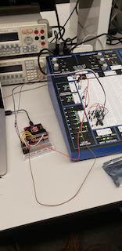

# CPE 1040 - Spring 2020

Author: Ivo Georgiev, PhD  
Last updated: 2020-03-18   
Code: b7700c9ccc9a009aacc7e5451992c43cc3135f87      



This is lesson and assignment 006 for the Spring 2020 installment of the CPE 1040 - Intro to Computer Engineering course at MSU Denver.

**NOTE:** 
1. This lesson & assignment [README](README.md) is _intentionally_ blank, to be used as the **Lab Notebook** for the study & submission. _It is a great aid for your study and the main component of your submission._
2. Read and follow the [lesson-and-assignment](lesson-and-assignment.md).
2. Refer to the [submission template](submission-template.md) for formatting expectations and examples. 
4. Refer to the [criteria and guide](criteria-and-guide.md) for the different components of your submission.

## Take-home lab kit

The take-home lab kit is meant to provide continuity of our lab projects across the transition to online instruction. Please, read the [BOM, guide, and care document](https://docs.google.com/document/d/18IDsrQlZY_QkmWG7FFtGqd9M2S1wL8ShJrD00aHwBwQ/edit?usp=sharing) and use it as a reference throughout the lesson and assignment.

##### Practice

We advise you to build a small circuit just to break it in. Suggestions:
1. Build our basic resistor and standalone LED on the long breadboard, and power it with 3.3V and 5V, using the power supply switch. _Is there a marked difference in brightness?_
2. Add a NPN transistor switch to the circuit, using the breadboard power supply ON-OFF switch as the base switch.

## Learning how to learn

The human mind is a very fine machine with amazing capabilities. And like any complex mechanism, it takes study to learn to use it effectively. This standalone section will contain practical information and advice for learning how to learn.

##### Learning How to Learn 01

1. The pain of learning.
   Knowledge is contain in the brain in complex neural structures, often distributed across the whole brain. Learning new knowledge is the process of _attaching_ or _fitting_ new concepts to your already existing _knowledge network_, and often requires significant rearranging to accomplish. This process is associated with _mild forms of pain and discomfort_. 
   
   TO DO: Learn to expect the natural discomfort that comes with learning and don't be afraid of it. Give it time. Approach the new concept from several different directions. Do not ever think that you are not good at this. You are already doing this just as everyone else. As your brain adjusts to the new knowledge, the pain goes away.
   
2. Focus & distraction.
   It might sound counterintuitive at first that both _focus_ and _distraction_ are important for learning, not just focus. The brain does different functions during focus and distraction, and all these functions contribute important steps to the learning process. Focus provides the ability to select a handful of related concepts, lock them into short-term memory, and apply directed effort to attach a new concept or set of concepts to the already existing knowledge. Incidentally, this is what is called _thinking_. Distraction helps the brain relax, recharge, and clean up.
   
   TO DO: The so called [_pomodoro technique_](https://francescocirillo.com/pages/pomodoro-technique) is a simple, yet effective way to gain operational control over periods of focus and distraction. Use a kitchen timer or the [online tomato timer](https://tomato-timer.com/), set it to 25 minutes and sit down to work a problem, keeping all distractions away (phone, other family members, bathroom, etc). Do your best to keep only the relevant concepts in mind and work the problem at hand. When the timer goes off, take a 5 minute distraction break. Take it as a reward, a chance to get brief relief from the discomfort. And practice. Like everything else, it takes some time to tell the difference and notice the effects. _Hint: 25 minutes is the average time the [hippocampus](https://en.wikipedia.org/wiki/Hippocampus) can remain fully active before it needs to rest. Some brains may be capable of less, say 15 minutes, or more, say 45 minutes. The online timer has adjustable settings, so you can experiment to find what works best for you._ 

## Lesson & Assignment 006: Flip-flops

This assignment & lesson introduces _capacitors_, _logic level conversion_, _flip-flops_, and _counters_:
  1. Capacitors are static circuit elements that can hold charge.   
  2. Flip-flops (aka _latches_) are among the simplest circuits that can have two different stable _states_ and their principle of operation lies at the basis of computer memory.    
  3. When two circuits work at differnet voltages, say 3.3V and 5V, any signals between them have to be safely converted.   
  4. Counters are sequential circuits which go continously cycle through several states representing binary numbers from 0 to some number 2n-1, in order.   

The goal of this assignment is to create a _modulus counter_ out of _D-type_ flip-flops, drive it from the micro:bit, and read off the 3-bit binary output with the micro:bit. The final build is shown in the image above. 

### Section 1: Capacitors

#### 1.1 Study

Capacitors are important cicruit elements which hold charge. They hold charge and their non-linear charging and discharging provide important functionality for circuits. They are represented as two plates with terminals as shown below:
```
    |
---------
---------   A capacitor has two plates across which there is voltage.
    |


    |   +
---------
---------   The voltage is caused by the accumulation and separation of opposite charges on the plates.
    |   -
    

    |   [+]
---------
---------   Some capacitors are polarized, with signs indicated. [+] should be connected to higher voltage.
    |   [-]
    
```
When voltage is applied to the two terminals, charge accumulates until the voltage between the plates (and terminals) of the capacitor equals the applied voltage. If the voltage is removed and there is a circuit connection between the two terminals, current flows from the terminal with the higher voltage toward the terminal with the lower voltage. Eventually, the current dissipates the accumulated charge and the voltage across the plates drops to zero.

Capacitors are a key component of a [flip-flop](https://www.youtube.com/watch?v=IykOrxVcdyg). Read the brief [section in Lesson 006: Memory on capacitors](https://docs.google.com/document/d/1TiirGwXiKg6ehxjVPpW-ISQryf8eqycvG4PZMq8cm2U/edit#heading=h.tfrh3hgmq4ay) and the materials referenced in it.

#### 1.2 Apply

1. This part lets you see how a capacitor operates. Build the circuit below on the long breadboard. _Note: If you don't have a 330 Ohm resistor, it's okay to use a 220 Ohm one. The 2200 uF capacitor is polarized, so [-] should be connected toward ground and [+] toward power._


2. The 2200uF capacitor is a large blue cylinder. It is _polarized_, so make sure you connect it properly.
3. Make sure the capacitor starts out _discharged_. _Hint: Connect the two terminals to a resistor._
4. Attach the multimeter, in voltage mode, at the point V<sub>C</sub> or, in current mode, anywhere in the circuit. Apply the circuit voltage source and watch the reading of the multimeter. As the capacitor charges, current will flow and there will be voltage drop across the resistor. When the capacitor reaches its charge capacity (that is, it _charges_), the current will diminish to zero Amperes and the voltage at V<sub>C</sub> will climb back to the power-supply voltage (either 3.3V or 5V). _Why?_
4. Now take the capacitor out of the circuit, making sure you don't touch the terminals to each other or connect them with a conductive channel, and plug it into the second circuit below:


5. Watch the LED light up then quickly fade to dark as the capacitor discharges through the circuit.

#### 1.3 Present

In the [Lab Notebook](README.md), include:
1. A short narrative about the experiment. _What is the voltage when the capacitor finishes charging? Why?_
2. The approximate time to charge and discharge the capacitor. (2 values)
3. An instantaneous value for the charging and discharging currents. (2 values) _Note: These currents are not constant, and with this equipment we may only be able to capture an instantaneous non-zero current value._

### Section 2: Logic level converter

#### 2.1 Study

The micro:bit works at 3.3V while we have to operate the circuit on the long breadboard at 5V. This means that a _logic high_ in the two circuits is actually at different voltages. Logic level voltages are a [big deal](https://www.allaboutcircuits.com/textbook/digital/chpt-3/logic-signal-voltage-levels/). Read the [short section in Lesson 006: Memory on binary numbers](https://docs.google.com/document/d/1TiirGwXiKg6ehxjVPpW-ISQryf8eqycvG4PZMq8cm2U/edit#heading=h.2bm72yu21rie).

Most importantly for us, the two circuits should **not** be connected directly to each other (as we did in the last assignment :D). Instead, we use a voltage (aka logic) level converter circuit to bridge the micro:bit and long breadboard circuits. We will be using [one of two voltage level boards](https://docs.google.com/document/d/18IDsrQlZY_QkmWG7FFtGqd9M2S1wL8ShJrD00aHwBwQ/edit#heading=h.fx9d22emrhnr). On the [board diagram of Bi-Directional Logic Level Converter](https://learn.sparkfun.com/tutorials/bi-directional-logic-level-converter-hookup-guide#board-overview), notice the [zener diode](https://www.digikey.com/en/maker/blogs/zener-diode-basic-operation-and-applications) across the FET, pointing from low voltage to high voltage!

#### 2.2 Apply

1. Hook up one of the converters and power it properly as shown in the hookup guide. It is best to use the lower part of the short breadboard, below the micro:bit breakout. You need to power the two sides with the two different voltages and two _different grounds_! _Warning: Please, do not confuse the **low voltage 3.3V** with the **high voltage 5V** or you will damage the converter._
2. Hook up a powered wire from the long breadboard to one of the lines on the _high-voltage (HV) side_ and the voltage on the opposite terminal on the _low-voltage (LV) side_ with the multimeter. Use the long breadboard power supply ON-OFF switch to power and depower the line. _Please, do this very gently!!!_
3. Now connect the _LV_ pin to a digital input pin of the micro:bit. Read the pin and light the LED matrix position at (0, 0) depending on the reading. Power and depower the line on the _HV_ pin. 
4. Hook up a ditigal output pin from the micro:bit to the _LV_, drive it with a short program, and measure the voltage on the _HV_ with the multimeter.
5. Now build a simple resistor-and-LED circuit on the long board, and drive it with the _HV_ pin. 

#### 2.3 Present

In the [Lab Notebook](README.md), include:
1. A short narrative about the experiment.
2. Short video of the operation of the circuit from 2.2.3.
3. Short video of the operation of the circuit from 2.2.5.

In the [repository](./), include:
1. File `microbit-program-2-2-3.js` with the code you used in task 2.2.3.
2. File `microbit-program-2-2-5.js` with the code you used in task 2.2.5.

### Section 3: Clock signal from the micro:bit

#### 3.1 Study

The flip-flop, which is the main theme of this lesson & assignment, is one of the simplest example of a large family of electronic circuits, called _sequential circuits_. Read the [short section in Lesson 006: Memory on sequential circuits](https://docs.google.com/document/d/1TiirGwXiKg6ehxjVPpW-ISQryf8eqycvG4PZMq8cm2U/edit#heading=h.c4o6su7uj2bg). The name "sequential" comes from the property of theses circuits to occupy different _states_ and their ability to switch from one state to another, in a predetermined sequence. Read the [short section in Lesson 006: Memory on state](https://docs.google.com/document/d/1TiirGwXiKg6ehxjVPpW-ISQryf8eqycvG4PZMq8cm2U/edit#heading=h.bal0y2eurxvq). 

Computers are large and complex sequential circuits with many components, the function of which has to be tightly _synchronized_. In simplest terms, this means that computer components have to change states at the same time, in strictly determined order. For this reason, each component changes state _only_ upon receiving a synchronizing signal, called a _clock_. Clock signals are almost exclusively in the form of _square waves_. The diagram below shows what a square wave looks like and why it's called so:
```
   5V       |------|      |------
            |      |      |          This is a "square" wave, which is typical of clock (CLK) signals in electronics.
   0V ------|      |------|          It changes from logic low to logic high and repeats forever.
                                     It is called "square" because of the right angles the horizontal and vertical edges form.
   ```
Different components are designed to change state at different _events_ of the square wave. The 4 main events are:
  1. Logic high.
  2. Logic low.
  3. Positive edge (that is, switching from low to high).
  4. Negative edge (that is, switching from high to low).
```
   5V       |------|      |------
            |  ^   |      |          Square wave with the different state-change events.
   0V ------|  |   |------|          
            ^  |   ^   ^
            |  |   |   |
            |  |   |   low
            |  |   neg edge
            |  high
            pos edge
   ```
The square wave is only one of a number of wave _functions_ that are commonly used in electric and electronic circuits. Two other common functions are the _triangle_ and _sine_ waves. A device that can generate various functions is called a _function generator_. This is one lab device that we have not been able to replace affordably for the take-home lab kit. Intead, we will use the micro:bit to generate our square wave.

#### 3.2 Apply

1. Write a program to produce a clock signal on the output of a digital write pin. Here is a simple program to get you started:
```TypeScript
basic.forever(function () {
    pins.digitalWritePin(DigitalPin.P12, 1)  // positive edge
    basic.pause(200)
    pins.digitalWritePin(DigitalPin.P12, 0)  // negative edge
    basic.pause(200)
})
```
2. Hook up pin 12 _through the logic level converter_ (from **3.3V** to **5V**) and to the simple circuit from task 2.2.5.
3. Modify the program to double the frequency (halve the pause time) on the press of button A and to halve the frequency (double the pause time) on the press of button B. _Hint: Look at your previous programs. You should have all the code._

#### 3.3 Present

In the [Lab Notebook](README.md), include:
1. A short narrative about the experiment.
2. Short video of the operation of the circuit from 3.2.2.
3. Short video of the operation of the circuit from 3.2.3.

In the [repository](./), include:
1. File `microbit-program-3-2-2.js` with the code you used in task 3.2.2.
2. File `microbit-program-3-2-3.js` with the code you used in task 3.2.3.

### Section 4: D-type flip-flop

#### 4.1 Study

Read the [section on the flip-flop in Lesson 006: Memory](https://docs.google.com/document/d/1TiirGwXiKg6ehxjVPpW-ISQryf8eqycvG4PZMq8cm2U/edit#heading=h.txu21jmors55) and the linked materials.

##### Notes on reading the datasheet

1. Our lab has 74LS74 chips, each containing two D-type positive-edge triggered flip-flops.
2. Only the first page of the [datasheet](http://www.ti.com/lit/ds/symlink/sn74ls74a.pdf) is necessary for this project.
3. Our chip has the _form factor_ and _pinout_ at the top right.
4. The _logic symbol_ at the bottom left shows _inputs on the left_ and _outputs on the right_, with signal flow and operation _from left to right_. This is standard in electronics diagrams.
5. The operation is specified in two ways:
   1. The _description_ does it in words. _In summary, the device transfers its input value at D onto its output Q (and inverted output /Q) only upon a positive edge of the clock input CLK._
   2. The _FUNCTION TABLE_ does it symbolically, but is equivalent to the description. _Note: An X represents a "don't care" input, that is, it doesn't matter what its value is; and an upward arrow means a positive edge._

#### 4.2 Apply

**TODO:**  Single flipflop, with output driving two external LED circuits. _Can it?_ Also, the clock should flash at matrix position (0, 0).

1. Place a 74LS74 chip in the middle of a breadboard tile (across the center groove). _Note: The chip has a **notch** or **dent**, which has to be pointing **UP**. Otherwise, you will burn both the chip and the tile underneath._
2. Using the pinout of the chip, connect the chip to V<sub>CC</sub> of 5V and GND of 0V.
3. ~Use the _function generator_ on the workstation to generate the clock signal for the _top_ flip-flop:~
   1. ~Set the wave form to **SQUARE**. _Make sure the high voltage is 5V._~
   2. ~Choose a very low frequency, say a _fraction of a Hz_. _You will want to vary the frequency with the nob at the top left of the workstation._~
   3. ~Connect the **OUT** column from the generator to your **1CLK** input.~
4. ~Connect a TTL logic switch to the **1D** input.~
5. ~Connect the **1Q** and **1/Q** to two TTL logic LEDs (top right). _Note: The bar on top of a symbol, in this case Q, means NOT. That is, whatever the value of Q is (logic high or logic low), /Q will be the opposite. We are using the **forward slash** because markdown cannot represent a bar._~
6. Connect **1/CLR** and **1/PRE** to logic high (5V).
7. With a very low clock frequency, toggle the input switch and watch the output LEDs. At low frequency, you will see a lag.
8. Increase the frequency to see that the lag stops being dinstinguishable.

#### 4.3 Present

**TODO**

1. Draw the circuit and include an image of the drawing in your README. _Use the **images** directory. See the [template](submission-template.md) or this file to see how to write the markdown for embedding images._
2. Take a picture of your setup and include it in your README.
3. ~With the switch at logic low, connect Channel 1 of the oscilloscope to your clock signal, and Channel 2 to your Q output. Set the _trigger_ on a _rising edge_ of Channel 2. Adjust the channels so you can see the clock on top of the Q output. (_We'll demo this in class._) Set the mode to **RUN** (not **AUTO**), then hit **SINGLE** and turn the input switch (D) on. You should be able to capture the Q signal rising from low to high, closely aligned _after_ a clock positive edge.~
4. ~Take a picture of the oscilloscope window and include in your README.~

### Section 5: 3-bit modulus counter

**TODO:** Counters are sequential machines whose states correspond to the natural numbers, starting at zero and cycling over at a number of the form 2n-1, and called mod-n counters.

#### 5.1 Study


_Note: An **active low** signal like **1/Q** and **1/CLR** signal can be represented in a diagram with its non-negated name and a circle ° at the terminal, as it is done in this diagram. The circle comes from the shortened representation of an **inverter**._

1. Reason and explain how this circuit works:
   1. On a sheet of paper with a checkerboard pattern, pick 4 lines at 4 rows from each other. Label at the left, from top to bottom, **CLK**, **1Q**, **2Q**, **3Q**.
   2. The lines are 0V and one row up from each line is 5V. Label them.
   3. Now trace the **CLK** square wave for 8 periods, up-down-up-down-...
   4. Study the first (leftmost, closest to the clock) flip-flop and calculate what the **1Q** output (aka **b<sub>0</sub>**) will trace, if driven by the clock you just traced. _Hint: Remember that the Q output changes to the value of D **only** on a positive edge of the clock signal._
   5. Do the same for the second, and then the third flip-flop. _Note: Notice that the clock input of a flip-flop other than the first one comes from the output Q of the previous one._
   6. Take a picture of your resulting diagram and embed it in a description of the circuit operation in your README.


#### 5.2 Apply

2. Using two 74LS74 chips, build a 3-bit modulus counter from 3 of the D-type flip-flops. _Don't forget to place the chips with notches pointing up, and to power and ground each chip._
3. Use the same clock signal from the previous [section](#requirements-1).
4. Disconnect the **1Q** input from the input switch. Instead, connect the 3 _clear_ signals **1/CLR**, **2/CLR**, and **3/CLR** together to the same switch and turn the switch on (red light). We'll call this the _clear switch_.
5. Connect the outputs **3Q**, **2Q**, and **1Q** to three logic output LEDs, so they line up _in this order_ (on the horizontal line of LEDs at the top right). _Note: These represent a **b<sub>2</sub>b<sub>1</sub>b<sub>0</sub>** pattern in the drawing above, representing a 3-bit binary integer._
6. Toggle the clear switch off and on quickly. This zeroes out the circtuit and then it starts counting from 0 to 7 _in binary_. Remember the patterns for binary counting: `000 - 001 - 010 - 011 - 100 - 101 - 110 - 111`. When an LED is lit up, it represents a 1, and when it is dark, a 0. Verify that your 3-bit counter is working properly. _Note: The fact that the counter returns to `000` after reaching `111`, always cycling through the numbers in the same order, gives it the name "modulus". In this case, this is modulus-8 (aka modulo-8 or mod-8). A modulus counter never reaches the number in its name. Remember 0-based counting!_
7. Record a video of your setup and the output LEDs counting and link to it in your README. _Note: Tune the frequency so as to minimize the video length but the individual numbers can still be seen._

   **TODO:** Expand the following to establish awareness of control signals.
   
8. Connect the clock and the 3 bit outputs to the 4 channels of the oscilloscope and record the counting in a video or image. Link to or embed in your README. _What signlal should you toggle on to see what your timing diagram shows?_

#### 5.3 Present

**TODO**

### Section 6: Display raw counter output on micro:bit external LEDs

**TODO**

### Section 7: Flip-flop control signals

**TODO:** Signals are clock out, 3-bit in, and ctl. Volgate converter has only 4 lines :(

#### 7.1 Study

**TODO**

#### 7.2 Apply

1. Use a second converter to drive the control signal **x/CLR** with a micro:bit digital write pin.
2. Modify your program to clear the counter on a simultaneous press of both A and B buttons. 
3. Commit to your repository as file `clk-led-clr.js'.
4. Record a video demonstrating the full operation of your circuit, including the initial clear, and link in the README.

#### 7.3 Present

**TODO**

### Section 8: Display decoded counter output on micro:bit LED matrix

**TODO:** Binary decoding.

#### 8.1 Study

**TODO:** Multiple `forever` loops. Events and event handlers. Asynchronous execution and reactive fiber scheduling. `onPulse` event and conditions for counter advancement. Decoding of 3-bit binary into decimal to display on LED matrix. Handling clock skew.

#### 8.2 Apply

1. Use 3 digital read pins to read off the binary counter number and display on the micro:bit LED matrix:
   1. Hook up the three **Q** outputs _through the logic level converter_ (from **5V** to **3.3V**) to 3 chosen micro:bit _digital read_ pins. _Note: First, disconnect them from the TTL output LEDs._
   2. Remember that the counter updates at every _positive edge_ of the clock. So, your program should check the values of the 3 digital read bits _between_ the clock pin writing 1 and writing 0:
   ```TypeScript
   basic.forever(function () {
       pins.digitalWritePin(DigitalPin.P12, 1)
       basic.pause(200)   // This will have to be reduced, and will mess the variable frequency
       let b0 = pins.digitalReadPin(DigitalPin.P0)
       let b1 = pins.digitalReadPin(DigitalPin.P1)
       let b2 = pins.digitalReadPin(DigitalPin.P2)
       // more code...
       pins.digitalWritePin(DigitalPin.P12, 0)
       basic.pause(200)
   })
   ```
   3. Remember what a _positional numeral system_ is and convert the bit pattern **b<sub>2</sub>b<sub>1</sub>b<sub>0</sub>** from binary to decimal. _Hint: Sum of powers._
   4. Show this number on the micro:bit LED matrix.
2. Commit to your repository as file `clk-led.js`.
3. Record a video showing the micro:bit driving the counter and showing the count on the LEDs, and link to it in your README. _Note: At this point, your circuit should look more or less like the picture at the top of the assignment._

   **TODO:** Expand the following to systematically explore issues of timing.

4. The extra computation that we are doing after the first `basic.pause(200)` in the code above is definitely going to _skew_ the clock signal. That is, the time it spends at logic high is going to be longer than the time it spends at logic low. Try to ameliorate this effect, by either experimenting with shorter pause times or by a more sophisticated method. As an extra bonus, try to devise such a solution that would work even when the frequency of the clock is modified by pressing the A and B buttons from the [previous section](#5-drive-counter-with-microbit). 
5. Commit to your repository as file `clk-led-no-skew.js`.
6. Record a video to show the full proper operation with minimal or no clock skew, and link in your README within an explanation of your method.

#### 8.3 Present

**TODO**

## Resources

### micro:bit 

1. [micro:bit lessons](https://makecode.microbit.org/lessons).
2. [micro:bit ideas](https://microbit.org/ideas/).
3. A list of some more [advanced projects](https://www.itpro.co.uk/desktop-hardware/26289/13-top-bbc-micro-bit-projects).
4. The [projects](https://github.com/carlosperate/awesome-microbit#%EF%B8%8F-projects) at the [awesome micro:bit list](https://github.com/carlosperate/awesome-microbit).
5. micro:bit [technical documentation](https://tech.microbit.org/).
6. micro:bit [reference](https://makecode.microbit.org/reference/), and [pins](https://makecode.microbit.org/reference/pins/servo-set-pulse), specifically.

### Transistors
1. Video of [transistor operation](https://www.youtube.com/watch?v=7ukDKVHnac4)
2. Video of [PN diode operation](https://www.youtube.com/watch?v=-SSkjWuUri4)
3. Video of [NPN and PNP transistor operation](https://www.youtube.com/watch?v=R0Uy4EL4xWs)
4. Video of [NPN vs. PNP Transistors as Common-Emitter Switches](https://www.youtube.com/watch?v=kNVaIqmKUoI)
5. Video of [semiconductor operation](https://www.youtube.com/watch?v=33vbFFFn04k) by Ben Eater.
6. Video of [transistor operation](https://www.youtube.com/watch?v=DXvAlwMAxiA) by Ben Eater.
7. Video of [MOSFET operation](https://www.youtube.com/watch?v=stM8dgcY1CA)

#### Transistor datasheets

1. NPN transistor [2N3904 datasheet](https://www.sparkfun.com/datasheets/Components/2N3904.pdf)
2. PNP Transistor [2N3906 datasheet](https://www.sparkfun.com/datasheets/Components/2N3906.pdf)

### Flip-flops
1. Very in-depth yet accessible Wikipedia article on [flip-flops](https://en.wikipedia.org/wiki/Flip-flop_(electronics))
2. Video of [flip-flop circuit build & operation](https://www.youtube.com/watch?v=IykOrxVcdyg)

#### Flip-flop datasheets

1. D-type flip-flop [74LS74](http://www.ti.com/lit/ds/symlink/sn74ls74a.pdf)

### Capacitors

1. A short lesson and video on [how a capacitor works](https://www.build-electronic-circuits.com/how-does-a-capacitor-work/)

### Sensors

1. SparkFun soil moisture sensor [hookup guide](https://learn.sparkfun.com/tutorials/soil-moisture-sensor-hookup-guide). _Note: The guide is for Arduino, not micro:bit, but that does not affect the operation of the sensor See the intro item in the [soil sensor section above](#soil-sensor)._

### Logic level converter

1. [Bi-directional logic level converter](https://www.sparkfun.com/products/12009) between 3.3V and 5V.
2. Converter [schematic](https://cdn.sparkfun.com/datasheets/BreakoutBoards/Logic_Level_Bidirectional.pdf), N-channel MOSFET [datasheet](https://cdn.sparkfun.com/datasheets/BreakoutBoards/BSS138.pdf), with [operation explanation](https://cdn.sparkfun.com/tutorialimages/BD-LogicLevelConverter/an97055.pdf), and **most importantly** [hookup guide](https://learn.sparkfun.com/tutorials/bi-directional-logic-level-converter-hookup-guide).

### Oscilloscopes

1. Video [Oscilloscopes Made Easy Part 1](https://www.youtube.com/watch?v=uU3FhH7_MWo&t=1s)
2. Video [EEVblog #279 - How not to blow up your oscilloscope](https://www.youtube.com/watch?v=xaELqAo4kkQ)
3. Video [Oscilloscopes Made Easy Part 2](https://www.youtube.com/watch?v=5VyotIVwRiA)
4. Video [How to use an oscilloscope (SparkFun)](https://www.youtube.com/watch?v=u4zyptPLlJI)
5. Video [Oscilloscope tutorial](https://www.youtube.com/watch?v=CzY2abWCVTY)
6. Video [Rigol 1000s Series docs (manuals, datasheets, videos)](https://www.rigolna.com/products/digital-oscilloscopes/1000z/)

### Github

1. Github Tutorial for Beginners ([webpage](https://product.hubspot.com/blog/git-and-github-tutorial-for-beginners)).
2. Github Basics for Mac and Windows ([video](https://www.youtube.com/watch?v=0fKg7e37bQE)).
3. git & Github Crash Course for Beginners ([video](https://www.youtube.com/watch?v=SWYqp7iY_Tc)).
4. Introduction to Github for Beginners ([video](https://www.youtube.com/watch?v=fQLK8Ib_SKk)).
5. About `git` ([webpage](https://git-scm.com/about)).
6. `git` [documentation](https://git-scm.com/doc) (webpage, book, videos, reference manual).
7. [Github markdown cheat sheet](https://github.com/adam-p/markdown-here/wiki/Markdown-Cheatsheet).

### JavaScript

1. Technically, the language which is used side-by-side with Blocks in the Makecode ronment is a subset of [TypeScript](https://makecode.com/language), which itself is a superset of JavaScript (technically, [ECMAScript](https://www.ecma-international.org/ecma-262/10.0/index.html#Title)), with some JS features not implemented in Makecode.
2. The limited [JavaScript mini-tutorial](https://makecode.microbit.org/javascript) in Makecode.
3. Official [TypeScript documentation](https://www.typescriptlang.org/docs/home.html):
   1. TypeScript in 5 min [tutorial](https://www.typescriptlang.org/docs/handbook/typescript-in-5-minutes.html). _Note: You will need to [download](https://www.typescriptlang.org/index.html#download-links) and install an integrated development environment (IDE). The two that I recommend are Visual Studio Code from Microsoft and WebStorm from JetBrains._
   2. The full documentation and reference is under _Handbook_. Bear in mind that you are drinking from the hose. Don't be surprised if not everything is presented in a strictly incremental manner.
4. In-browser TypeScript [playground](https://www.typescriptlang.org/play/index.html). Note that micro:bit specific code will not run, but you can still play. _Start making the distinction between a generic multi-purpose programming language (TypeScript) and functionality (packages, libraries, objects, etc.) that is specific to a particular device (micro:bit), though written in the same programming language._
5. A pretty good and very palatable JS tutorial with in-browser coding, by [Codecademy](https://www.codecademy.com/learn/introduction-to-javascript).
6. Extensive and detailed [JS tutorial](https://javascript.info/), with some advanced material thrown in. **I like this one!**
7. The most authoritative JS resource on the Web, including tutorials and reference, by [Mozilla](https://developer.mozilla.org/en-US/docs/Web/JavaScript).
